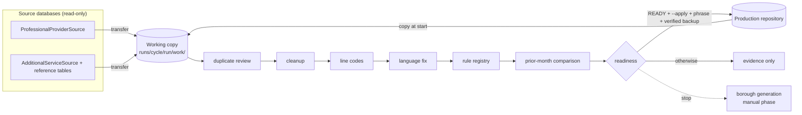

# directory-qa-pipeline

[](https://github.com/data-dl/directory-qa-pipeline/actions/workflows/tests.yml)

A controlled monthly data-quality pipeline for a healthcare provider directory that
lives on a legacy single-file database. Python drives the cycle; the database behind
it can be SQLite (portable - runs anywhere) or Microsoft Access (the target platform,
whose backend is the next phase).

**Status:** the full monthly cycle runs end to end on the portable SQLite backend and is
graded against a synthetic answer key in CI. The interactive layer (dialogs, long-running
routines) is designed, declared in config and tested; its Access implementation is the
next phase. Read [docs/guidebook.md](docs/guidebook.md) for the whole design in plain
language, and [docs/demo_script.md](docs/demo_script.md) for a five-minute walkthrough.

## Reviewing this repo

- **Five minutes:** this page, then [docs/sample_run/summary.md](docs/sample_run/summary.md) -
  one real run's output.
- **Fifteen minutes:** clone it and run the three commands under *How to run*. Nothing to
  install beyond Python 3.11+.
- **Thirty minutes:** read [config/rules.yaml](config/rules.yaml) (the rule registry),
  [dirqa/stages/duplicates.py](dirqa/stages/duplicates.py) (the classifier and decision log),
  and [tests/test_pipeline.py](tests/test_pipeline.py) (the end-to-end grading).
- **Every design decision, with the why:** [docs/guidebook.md](docs/guidebook.md), Parts 7-8.

## The problem

The scenario this project models: every month, two directory datasets - individual practitioners with their practice
locations, and facilities / vendors / ancillary services - are refreshed from source
systems into a central repository, cleaned, checked, compared with the prior month,
and handed off to a publication step. In the scenario the platform is Microsoft Access,
the checks are spread across saved queries, form buttons and a spreadsheet of notes,
and several steps need a person's judgment and cannot be automated safely.

This project puts engineering controls around that cycle without replacing the
platform: rules are externalized, every run leaves evidence, and the storage layer is
abstracted so the same pipeline runs against Microsoft Access or SQLite.
Everything runs on synthetic data: every row is invented and every name is fictional.

## What the pipeline guarantees

- **Dry run by default.** Changing production requires `--apply` *and* an exact authorization phrase.
- **Production is written once, at the end, or not at all.** Every run works on a copy;
  only the final stage can promote it, after a verified backup and a READY verdict.
- **Every check is a declared rule** with a severity: *blocking* (must pass), *advisory*
  (reported), *reminder* - in one YAML file with a promotion history.
- **Duplicates are classified, never guessed.** Only rows identical in every meaningful
  field *and* sharing a stable identifier are deleted automatically. Human decisions on the
  rest are logged by content hash and reapplied next month.
- **Blank never becomes zero.** Derived codes are written only where the inputs are complete;
  the rest are exported for a business rule.
- **Every run leaves evidence:** a manifest, a human-readable summary, a CSV for every finding.
- **Idempotent.** Running the same month twice finds nothing left to do.
- **Stops before publication.** Borough generation is a separate, manual phase by design.

## How it flows



| stage | what it does |
|---|---|
| preflight | files, lock files, inventory, hashes, expected objects |
| backup | fresh hash, copy, hash the copy, verify, prune old backups |
| transfer | schema check, completion markers, delete-and-load, exact count |
| professional_duplicates | official query -> partition -> classify -> delete only exact copies |
| service_cleanup | approved deletion list and retired feeds, by exact identifier |
| service_duplicates | address review, then phone review on what remains |
| line_codes | derive the code where all flags are present; export the partial rows |
| pharmacy_languages | normalize, export old/new, rerun the QA query |
| quality_checks | evaluate the rule registry; classify the informal checklist |
| comparison | this month vs last, with rows-per-location to explain growth |
| readiness | every condition as yes/no; READY or NOT READY; stop before borough generation |
| promote | apply mode only: phrase + verified backup + READY + unchanged hash |

## How to run

```bash
python -m venv .venv
.venv/Scripts/python -m pip install -e ".[dev]"        # Mac/Linux: .venv/bin/python
python -m synth --out demo                             # build the synthetic databases (1-2 s)
python -m dirqa run --config config/demo.yaml          # dry run: the whole cycle on a working copy
python -m dirqa rules --config config/demo.yaml        # list the rule registry
python -m dirqa phrase --config config/demo.yaml       # the exact phrase --apply requires
python -m pytest                                       # 69 tests
```

A run writes `runs/<cycle>/<run>/` with `summary.md`, `manifest.json` and an `evidence/`
folder, and prints one line per stage plus the readiness verdict.

On the demo data a dry run ends **NOT READY**, on purpose: the pipeline removes every
provable duplicate (243 rows, zero false deletions), applies the approved removals,
populates 24,000 line codes and fixes 210 malformed language strings, then reports what
only a person can resolve - blank counties, an excluded practitioner who is back in the
feed, a borough with no vision listings, and the duplicate groups that need a decision.
[docs/sample_run/](docs/sample_run/) holds one real run's output.

## Data

Every record in this repository is synthetic, produced by `synth/` from a fixed seed,
with deliberately planted defects and an answer key so the pipeline's findings can be
scored against ground truth. Only the borough / county / ZIP geography is real.

Twenty kinds of defect are planted: exact and near duplicates, legitimate multiples that
look like duplicates, redundant and legitimate phone matches, missing fields, invalid
specialty-county pairs, missing limitation text, ZIP codes in the wrong borough, partial
flags, malformed language strings in every pattern the source produces, a retired source
feed, a feed that quadrupled by sending one row per service line, a borough whose vision
listings vanished, a practitioner who must not appear, and an organization carrying lines
it must not. `demo/answer_key.json` lists each one by record id. See
[demo/README.md](demo/README.md) for the file layout and [ASSUMPTIONS.md](ASSUMPTIONS.md)
for every invented default and its status.

## What this demonstrates

- **Data-quality engineering:** a rule registry with severities and promotion, blocking
  gates versus advisory reports versus grouped listings, and an informal checklist turned
  into testable checks.
- **Safe batch design:** dry-run default, working-copy execution, hash-verified backups,
  exact authorization, idempotent stages, completion markers, retention.
- **Human-in-the-loop resolution:** a duplicate classifier that deletes only what it can
  prove and remembers what people decide.
- **Testability of a legacy workflow:** a synthetic generator with an answer key, a storage
  interface with a portable backend, and an interactive layer (dialog policy, slow-versus-
  stalled watchdog) that is testable without the platform present.
- **Auditability:** a manifest and evidence CSVs for every run, and a readiness verdict that
  records what was accepted and by whom.

## Layout

```
config/          demo.yaml (paths, names, transfers, dialogs, action timings),
                 queries.yaml (saved-query library), rules.yaml (the rule registry),
                 decisions/ (person-written decision logs)
dirqa/           the pipeline package
  backends/      base.py (the interface), sqlite.py (portable), access.py (documented DAO stub)
  runners/       base.py (dialog policy, action timing), watchdog.py, scripted.py
  rules/         registry loader and evaluator
  evidence/      run manifest, evidence CSVs, summary.md
  stages/        one file per stage, in run order
  context.py     starts a run: working copy, backends, manifest
  state.py       completion markers that survive between runs
  pipeline.py    stage order and stop rules;  cli.py  python -m dirqa
synth/           synthetic-data generator and answer-key writer
demo/            generated databases (ignored) and committed samples + answer key
docs/            guidebook.md, demo_script.md, and a sample run's output
tests/           69 tests; GitHub Actions runs ruff and pytest on every push
```

## Tests

The tests cover the generator's contract (every planted defect is where the answer key
says, the prior month is clean, the same seed gives the same bytes), the backend, the rule
evaluator, the duplicate classifier, the dialog policy and watchdog, and the pipeline end
to end: a dry run graded against the answer key, an apply run blocked while NOT READY, an
apply run with logged decisions and accepted findings that promotes, and a second run that
finds nothing left to do. Plus a repository-wide ban on three production vocabulary terms.

## License

MIT.
